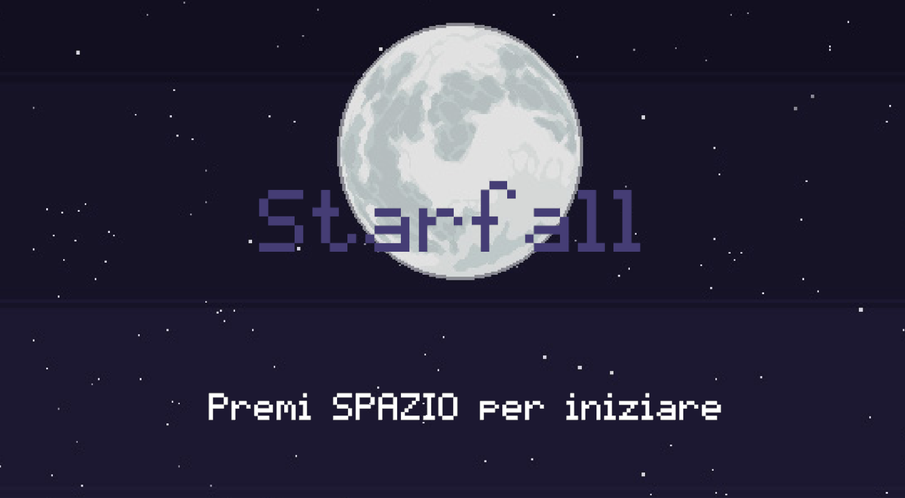
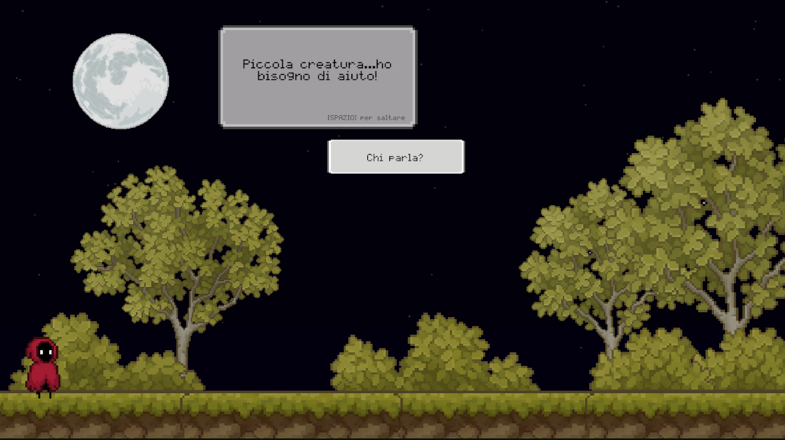
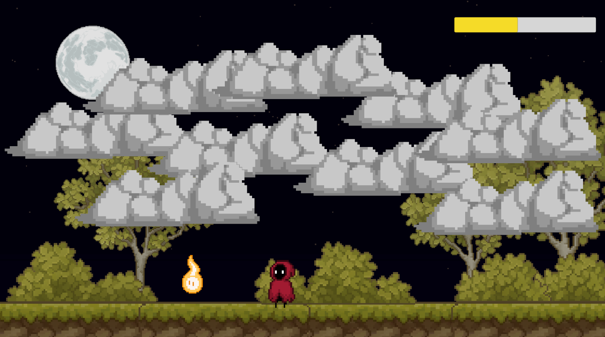
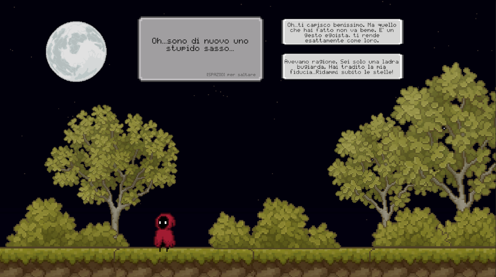

# 🌌 Starfall

**Starfall** is a **2D narrative video game** that bridges the gap between active player agency and structured storytelling. Developed as my thesis project to explore human storytelling instincts and intermediality, the game challenges players with **ethical choices** and **mechanical obstacles** that directly impact the narrative flow. Driven by an integrated storytelling engine, your decisions culminate in distinct, **emotionally charged endings**.

🎮 **[Play the game directly in your browser on Itch.io!](https://tamaciachi.itch.io/starfall-project)**

## 💻 About my role

I took on the roles of both **Game Designer** and **Developer** to create a fully functional 2D narrative experience in **Unity** and **C#**. I independently designed and programmed several core systems:

*   **Game & Dialogue Management**: Implemented the **Singleton** pattern to centrally manage the overall game state and dialogues. I utilized **Coroutines** to smoothly control the appearance of dialogue text and prevent overlapping events.
*   **Gameplay Progression**: Structured the three distinct phases of the star-falling mechanics using a **Finite State Machine (FSM)**.
*   **Dynamic Spawning**: Built a custom system for the falling stars utilizing **Object Pooling**. This recycles objects instead of constantly destroying and instantiating them, preventing memory saturation and performance drops.

## 📸 Screenshots

  
  
    
  
  

## ⌨️ Controls

*   **WASD / Arrow Keys:** Move
*   **E:** Interact with objects
*   **Left Mouse Click:** Interact with buttons

## 🎨 Assets & Credits
This project uses free graphical assets from the Itch.io community. A full list of credits and attributions can be found on the game's Itch.io page linked at the top of this document.
